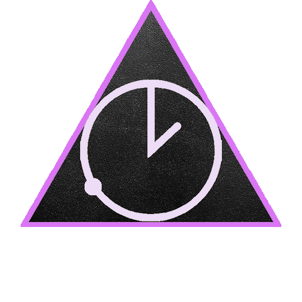

  

<h1 align="center">Orbit-Watches</h1>

A website to showcase my Fitbit watch faces.

## Technologies 🤖

## Description

I created a simple webiste using HTML and CSS to display the Fitbit clock faces I have developed.  There are details on how to download, purchase, and troubleshoot.  Each watch face is a link to the Fitbit watch gallery.

  

Deployed <a href="https://www.orbit-watches.com">here</a>!

### Made with ❤️ by  Brad Dunham
